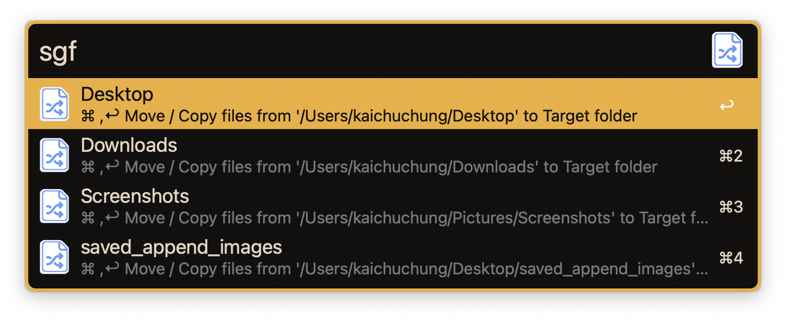

# alfred-source2target

> Swiftly transfer and replicate files between origin and destination directories via fuzzy search

## Prerequisite
- Alfred 5
- dependaencies
  -  [sharkdp/fd: A simple, fast and user-friendly alternative to 'find'](https://github.com/sharkdp/fd)

## Features
- Add / Remove **Source** folder
- Transfer and replicate files from **Source** folder to frontest Finder or QSpace Pro location
- Transfer and replicate files from **Source** folder to **Target** folder picked from Alfred

## Usage

Add the **Source** folder through the `sf` keyword, all actions will start from the source folder

Manage the **Source** folder
- ADD
- REMOVE exist **Source** folder

Move / Copy **Source** folder files to frontest Finder location via `scf` keyword
- `⌘` to manage **Source** folder
- Choose the **Source** folder and start to fuzzy search

Move / Copy **Source** folder files to Target folder picked from Alfred via `sgf` keyword
- `⌘` to manage **Source** folder
- Choose the **Source** folder and start to fuzzy search

Both of `scf` & `sgf` keyword support `fd` fuzzy search (Please visit [sharkdp/fd](https://github.com/sharkdp/fd) to check more detail information). For example, `--changed-within 1w` will only show files changed within 1 week, `-e alfredworkflow` will only show file extensions is `.alfredworkflow`

### `scf`

- `Enter` move result files (1-4) to frontest Finder location
- `⇧` + `Enter` send recent files (1-4) up to this file to the pasteboard
- `⌥` + `Enter` copy result files (1-4) to frontest Finder location
- `⌘` + `Enter` move ONLY this file (4) to to frontest Finder location
- `⌘` + `⇧` + `Enter` send ONLY this file (4) to the pasteboard
- `⌘` + `⌥` + `Enter` copy ONLY this file (4) to to frontest Finder location

Also support `#1,3-4,7` range selection syntax fulfill specific file(s)

- start range with `#` means file index
-  `#1,3-4,7` means the first, third, fourth and seventh file

### `sgf`

- `Enter` move result files (1-2) to **Target** folder picked from alfred later
- `⇧` + `Enter` send recent files (1-2) up to this file to the pasteboard
- `⌥` + `Enter` copy result files (1-2) to **Target** folder picked from alfred later
- `⌘` + `Enter` move ONLY this file (2) to to **Target** folder picked from alfred later
- `⌘` + `⇧` + `Enter` send ONLY this file (2) to the pasteboard
- `⌘` + `⌥` + `Enter` copy ONLY this file (2) to to **Target** folder picked from alfred later

Also support `#1,6` range selection syntax fulfill specific file(s)

- start range with `#` means file index
-  `#1,6` means the first and sixth file

## Change Log

Vist [CHANGELOG.md](CHANGELOG.md) to check detail information

## License
This project is licensed under the MIT License. See [LICENSE](LICENSE) for details.